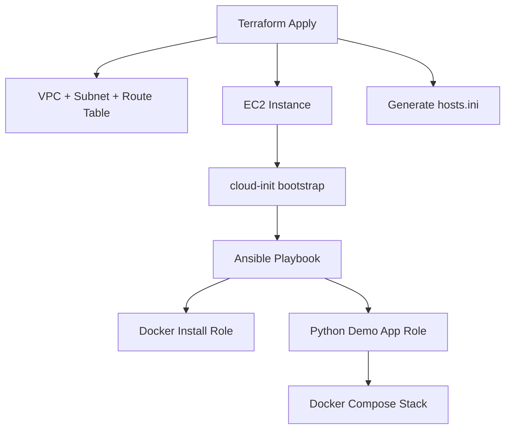

# ccore-ai-infra

Infrastructure-as-Code templates for AWS using **Terraform** and **Ansible**.  
This repository demonstrates a clean, production‑grade DevOps workflow.

- AWS VPC + networking
- EC2 provisioning
- Secure bootstrap using cloud-init
- Automated configuration with Ansible
- Environment separation (dev / prod)
- CI examples for Terraform & Ansible

The goal is to showcase real DevOps engineering practices in a minimal, reproducible form.

---

## 📌 Terraform State (Production Recommendation)

Production setups must use:

- **S3 bucket** for remote Terraform state
- **DynamoDB table** for state‑locking

For demo purposes this repo keeps state **local**, but switching to S3+DynamoDB requires only updating the backend block.

---

## 1. Architecture Overview

```
Terraform → AWS infra → cloud‑init → Ansible → Docker → Full app stack
```

Mermaid diagram:



---

## 2. Folder Structure

```
ccore-ai-infra/
├── terraform/
│   ├── modules/
│   │   ├── network/
│   │   └── compute/
│   ├── envs/
│   │   ├── dev/
│   │   └── prod/
│   └── README.md
│
├── ansible/
│   ├── inventory/
│   │   └── hosts.ini        # Auto‑generated by Terraform
│   ├── playbook.yml
│   ├── roles/
│   │   ├── docker-install/
│   │   └── python-demo-app/
│   └── README.md
│
├── diagrams/
│   └── architecture.mmd
│
└── README.md
```

Terraform provisions infra → then generates:

```
ansible/inventory/hosts.ini
```

Example:

```
[app]
3.67.196.100 ansible_user=ubuntu
```

This keeps IPs out of Git and ensures always‑fresh inventory.

---

## 3. Usage

### Step 1 – Configure AWS credentials

Either:

- AWS SSO
- or access keys
- or env variables  
  (`AWS_ACCESS_KEY_ID`, `AWS_SECRET_ACCESS_KEY`)

### Step 2 – Initialize Terraform

```
cd terraform/envs/dev
terraform init
```

### Step 3 – Apply infrastructure

```
terraform apply
```

### Step 4 – Run Ansible provisioning

```
ansible-playbook -i ansible/inventory/hosts.ini ansible/playbook.yml
```

This installs:

- Docker Engine
- Docker Compose plugin
- Python demo app
- Nginx reverse proxy
- SSL (self‑signed)
- Complete Docker Compose stack under `/opt/app`

---

## 4. Technologies Used

- Terraform
- Ansible
- Docker & Docker Compose
- AWS EC2 / VPC / IAM
- cloud‑init
- GitHub Actions CI

---

## 5. Purpose

Designed to:

- Demonstrate real DevOps workflows
- Provide reusable AWS IaC templates
- Serve as a training/portfolio project
- Maintain clarity + minimalism

---

## 6. License

MIT License.
