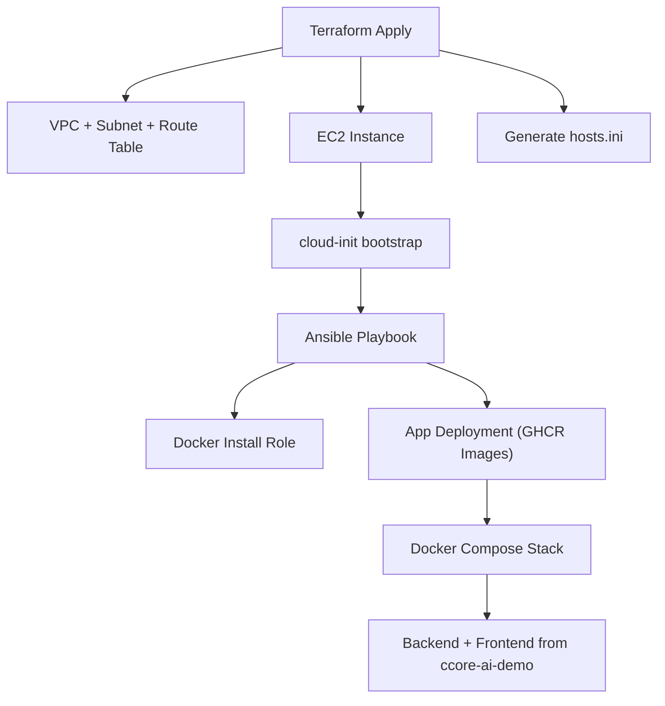

# DevOps AWS Terraform + Ansible Stack

<p>
  
  
  
  
</p>

<p>
  
  
</p>

Infrastructure-as-Code templates for AWS using **Terraform** and **Ansible**.  
This repository demonstrates a clean, production‑grade DevOps workflow with full application integration.

---

## 1. Application Integration (ccore-ai-demo)

This infrastructure stack deploys the application layer from a separate repository:

🔗 https://github.com/LaurisNeimanis/ccore-ai-demo

The EC2 instance uses **pre‑built Docker images** from GHCR:

- `ghcr.io/laurisneimanis/ccore-ai-demo-backend:latest`
- `ghcr.io/laurisneimanis/ccore-ai-demo-frontend:latest`

No application build happens on EC2 — deployments are fully **pull‑based**.

Security groups follow _least privilege_ principles and expose only **HTTPS** publicly.

---

## 2. Terraform State (Production Recommendation)

Production-grade setups should use:

- **S3** for remote Terraform state
- **DynamoDB** for Terraform lock table

This repository keeps state **local** for demo purposes.

---

## 3. Prerequisites

- Terraform ≥ 1.6
- Ansible ≥ 2.15
- AWS CLI configured (SSO or access keys)
- SSH access enabled (cloud-init prepares the EC2 instance automatically)
- GitHub Actions runners

---

## 4. Architecture Overview

```
Terraform → AWS infra → cloud-init → Ansible → Docker → GHCR images → Full app stack
```

EC2 instances are prepared using **cloud-init**, which installs Python3 and writes a readiness marker (`/var/log/bootstrap_ready.log`).



> Full detailed architecture diagram: `diagrams/architecture.mmd`

---

## 5. Folder Structure

```
ccore-ai-infra/
├── terraform/               # AWS IaC (modules + environments)
│   ├── modules/             # Reusable Terraform modules (network, compute)
│   ├── envs/                # Dev/prod environment stacks
│   └── README.md            # Terraform usage instructions
│
├── ansible/                 # Server provisioning (Docker, Nginx, app)
│   ├── inventory/           # Auto-generated EC2 host inventory
│   ├── roles/               # Modular roles (docker-install, app deployment)
│   ├── playbook.yml         # Main provisioning entrypoint
│   └── README.md            # Ansible documentation
│
├── diagrams/                # Architecture diagrams (Mermaid)
│   └── architecture.mmd
│
├── .github/                 # CI (Terraform + Ansible Lint)
│   └── workflows/
│       ├── ansible-lint.yml
│       └── terraform-ci.yml
│
├── LICENSE
└── README.md
```

Terraform provisions infrastructure → generates:

```
ansible/inventory/hosts.ini
```

Example:

```
[app]
3.67.196.100 ansible_user=ubuntu
```

---

## 6. CI Status

- **Terraform CI** – fmt, validate, init, plan
- **Ansible Lint** – checks roles, tasks and templates
- CI pipeline runs automatically on **push / PR**

---

## 7. Usage

### Step 1 — Configure AWS

Use either:

- AWS SSO
- Access keys
- ENV variables (`AWS_ACCESS_KEY_ID`, `AWS_SECRET_ACCESS_KEY`)

### Step 2 — Initialize Terraform

```
cd terraform/envs/dev
terraform init
```

### Step 3 — Apply infrastructure

```
terraform apply
```

### Step 4 — Run Ansible provisioning

```
ansible-playbook -i ansible/inventory/hosts.ini ansible/playbook.yml
```

This installs:

- Docker Engine
- Docker Compose plugin
- Nginx reverse proxy
- SSL (self‑signed, demo mode)
- GHCR images
- Full application stack under `/opt/ccore-ai`

---

### Redeploy After New Image Builds

When **ccore-ai-demo** publishes new images:

```
docker compose -f /opt/ccore-ai/docker-compose.yml pull
docker compose -f /opt/ccore-ai/docker-compose.yml up -d
```

Playbook is **idempotent** — safe to run any time.

---

## 8. Technologies Used

- Terraform
- Ansible
- Docker & Docker Compose
- AWS EC2 / VPC
- cloud-init
- GitHub Actions

---

## 9. Purpose

Designed to:

- Demonstrate real DevOps workflows
- Provide reusable AWS IaC templates
- Serve as a high‑quality portfolio project
- Maintain clarity and minimalism

---

## 10. License

MIT License.
