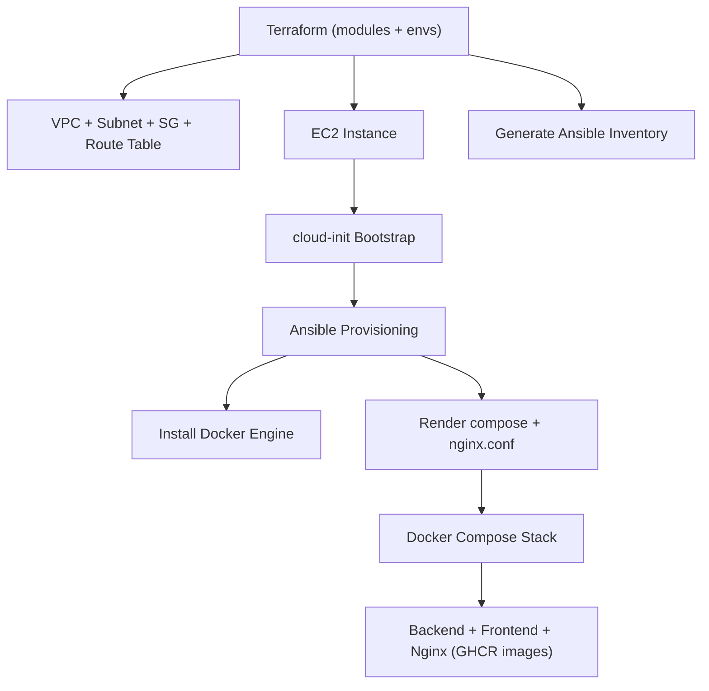

# Infrastructure Architect Demo — AWS Terraform + Ansible + Docker Stack

This repository demonstrates a **production-grade, modular Infrastructure-as-Code architecture** built using:

- **Terraform** (modular AWS VPC + EC2 provisioning)
- **cloud-init** (bootstrap & provisioning preparation)
- **Ansible** (server configuration & container stack deployment)
- **Docker + GHCR images** (pull-based, immutable deployments)
- **GitHub Actions CI** (linting & validation)

The project intentionally mirrors real-world DevOps, SRE and Infrastructure Architect standards:  
clean separation of concerns, reproducibility, automated provisioning, minimalism, and clarity.

---

## 1. High-Level Architecture

```
Terraform → AWS (VPC, EC2) → cloud-init → Ansible → Docker Compose → GHCR images
```

Each layer is strictly separated:

### **Terraform (Infrastructure)**
- Creates VPC, subnet, route table, security group
- Deploys EC2 Ubuntu 24.04 instance
- Looks up AMIs dynamically
- Generates Ansible inventory automatically
- Injects cloud-init bootstrap script

**Detailed Terraform documentation:**  
`terraform/README.md`

### **cloud-init (Machine Bootstrap)**
- Prepares instance for configuration
- Installs Python3
- Enables SSH
- Writes readiness marker to `/var/log/bootstrap_ready.log`

### **Ansible (Configuration & Deployment)**
- Installs Docker Engine & Compose
- Creates `/opt/ccore-ai` deployment path
- Renders templated configs (`docker-compose.yml`, `nginx.conf`)
- Pulls GHCR images (backend, frontend, nginx)
- Runs container stack with idempotent Docker Compose

**Detailed Ansible documentation:**  
`ansible/README.md`

### **Application Layer**
All application components come from **pre-built GHCR images**, not from local builds:

- `ghcr.io/laurisneimanis/ccore-ai-demo-backend:latest`
- `ghcr.io/laurisneimanis/ccore-ai-demo-frontend:latest`

This ensures:
- Immutable artifacts  
- Reproducible deployments  
- Zero source code on the server  
- No Dockerfiles in this repo  

---

## 2. Repository Structure

```
ccore-ai-infra/
├── terraform/               # AWS infrastructure (modules + environments)
│   ├── modules/             # Reusable IaC components (network, compute)
│   ├── envs/                # Dev/prod Terraform stacks
│   └── README.md            # Terraform layer documentation
│
├── ansible/                 # Provisioning and configuration management
│   ├── inventory/           # Auto-generated by Terraform
│   ├── roles/               # docker installation + app deployment
│   ├── playbook.yml
│   └── README.md            # Ansible layer documentation
│
├── diagrams/
│   └── architecture.mmd     # Mermaid architecture diagram
│
├── .github/
│   └── workflows/           # Terraform validate + Ansible Lint CI
│
├── LICENSE
└── README.md                # (this file)
```

Everything is compartmentalized for maintainability and scalability.

---

## 3. Architecture Diagram



---

## 4. CI Pipeline

This repository includes automated validation:

### **Terraform CI**
- `fmt`
- `validate`
- `init`
- `plan` (no apply)

### **Ansible Lint CI**
- Role/task/template linting

CI is triggered on **push and pull requests**.

---

## 5. Usage

### **1 — Provision AWS Infrastructure**
```
cd terraform/envs/dev
terraform init
terraform apply
```

### **2 — Provision Server with Ansible**
```
ansible-playbook -i ansible/inventory/hosts.yaml ansible/playbook.yml
```

### Result
- Docker installed  
- Compose stack deployed  
- Backend + frontend + nginx running at EC2 public IP  

### Redeploy Application (new GHCR image build)
```
docker compose -f /opt/ccore-ai/docker-compose.yml pull
docker compose -f /opt/ccore-ai/docker-compose.yml up -d
```

---

## 6. Technologies Used

- **AWS**: VPC, Subnet, IGW, EC2
- **Terraform**: modules, envs, dynamic inventory
- **Ansible**: roles, templates, provisioning
- **cloud-init**: bootstrap automation
- **Docker + GHCR**: pull-based deployments
- **GitHub Actions**: CI validation pipelines

---

## 7. Purpose

This repository is built to demonstrate:

- Enterprise-level IaC design  
- Modular, scalable cloud architecture  
- Automated end-to-end provisioning workflows  
- Clear Infrastructure Architect thinking  
- Real-world DevOps execution with Terraform + Ansible  
- Zero-drift design with CI, linting, templates and automation  

It is suitable as a **portfolio project**, **interview reference**, and **DevOps architecture showcase**.

---

## 8. License

MIT License.
