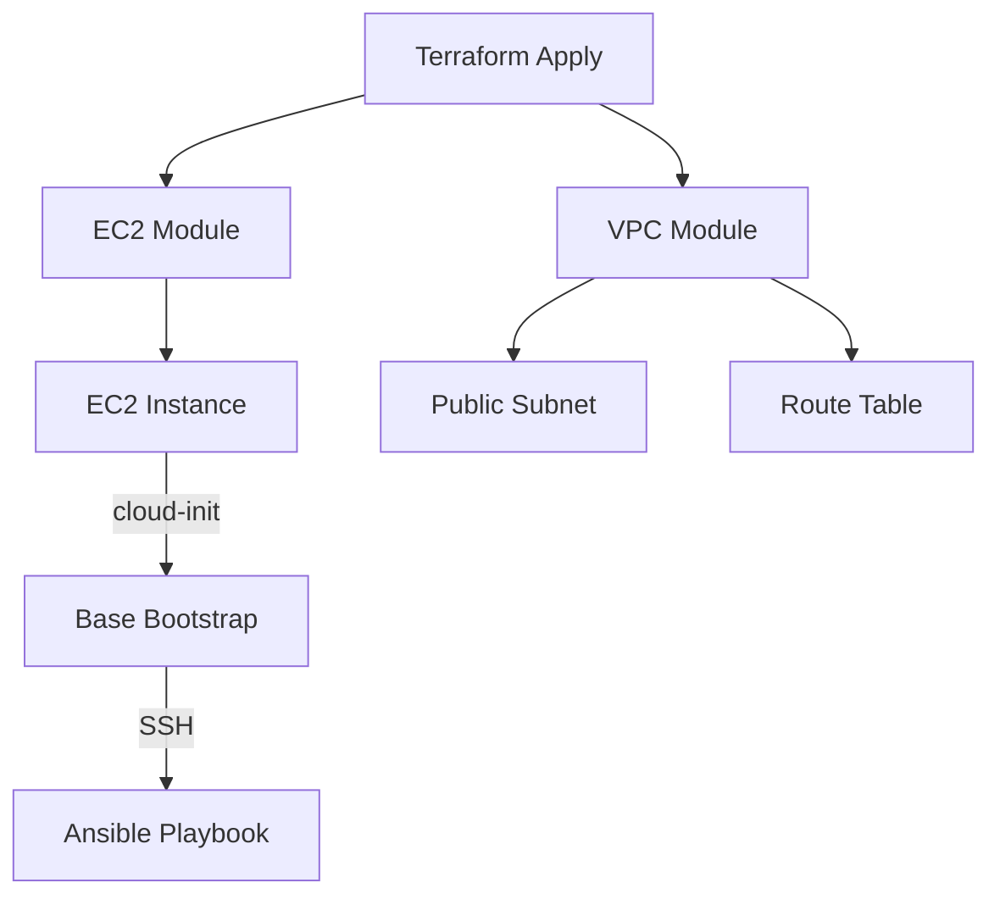

# ccore-ai-infra

Infrastructure-as-Code templates for AWS using **Terraform** and **Ansible**.  
This repository demonstrates a clean, production-grade DevOps workflow:

- AWS VPC + networking
- EC2 provisioning
- Secure bootstrap using cloud-init
- Automated configuration with Ansible
- Environment separation (dev / prod)
- CI examples for Terraform & Ansible

The goal of this project is to showcase real DevOps engineering practices in a
minimal, reproducible form.

---

## 📌 About Terraform State (S3 + DynamoDB Recommendation)

In real production environments, Terraform state **must not** be stored locally.  
A standard best-practice setup uses:

- **S3 bucket** → remote backend for Terraform state
- **DynamoDB table** → state-locking to prevent concurrent operations

Example production backend:

```hcl
terraform {
  backend "s3" {
    bucket         = "my-tfstate-bucket"
    key            = "ccore-ai/infra/terraform.tfstate"
    region         = "eu-central-1"
    dynamodb_table = "terraform-locks"
    encrypt        = true
  }
}
```

For this demo repository, the backend is intentionally kept **local** to avoid requiring
additional AWS resources and to make onboarding simple.  
The design still fully supports adopting S3+DynamoDB when moving to production.

---

## 1. Architecture Overview

The infrastructure follows a clean, separated structure:

- **terraform/modules/network** – VPC, subnets, routing, IGW
- **terraform/modules/compute** – EC2 instance provisioning
- **terraform/envs/** – Environment-specific Terraform configs
- **ansible/** – Post-provision configuration
- **GitHub Actions** – CI pipeline examples

A simplified diagram:



---

## 2. Folder Structure

```
ccore-ai-infra/
├── terraform/
│   ├── modules/
│   │   ├── network/
│   │   ├── compute/
│   ├── envs/
│   │   ├── dev/
│   │   ├── prod/
│   └── README.md
│
├── ansible/
│   ├── playbook.yml
│   ├── roles/
│   │   ├── docker-install/
│   │   └── app-deploy/
│
├── diagrams/
│   └── architecture.mmd
│
├── .github/
│   └── workflows/
│       ├── terraform.yaml
│       └── ansible.yaml
│
├── LICENSE
└── README.md
```

This layout clearly separates infrastructure provisioning from configuration management, following strong IaC best practices.

---

## 3. Usage

### Step 1: Configure AWS credentials

Either:

- AWS SSO
- or standard AWS access keys
- or environment variables (`AWS_ACCESS_KEY_ID`, `AWS_SECRET_ACCESS_KEY`)

### Step 2: Initialize Terraform

```bash
cd terraform/envs/dev
terraform init
```

### Step 3: Create the environment

```bash
terraform apply
```

Terraform will:

- create VPC + networking
- create an EC2 instance
- attach security groups
- inject user-data bootstrap

### Step 4: Run Ansible provisioning (Dynamic Inventory)

Ansible uses the **AWS EC2 Dynamic Inventory plugin**.  
It discovers instances by tags (`Role=app`, `Env=dev`) — no need to manually pass IPs.

```bash
ansible-playbook -i ansible/inventory/aws_ec2.yml ansible/playbook.yml
```

It automatically:

- queries AWS for instances
- identifies the correct EC2 host
- connects using your SSH key
- applies the playbook

This provisioning step installs:

- Python (required for Ansible)
- Docker Engine
- Basic OS configuration
- Example application code (if added later)

---

## 4. Technologies Used

- **Terraform** — Infrastructure creation
- **Ansible** — Server configuration
- **AWS EC2 / VPC / IAM**
- **GitHub Actions** — CI examples
- **cloud-init** — instance bootstrap

---

## 5. Purpose of This Repository

This project is designed to:

- Demonstrate real-world DevOps skillset
- Provide clean AWS IaC examples
- Serve as a reusable template for small deployments
- Act as a training/portfolio reference for cloud engineering

The goal is clarity, reproducibility, and simplicity — not complexity.

---

## 6. License

MIT License.
