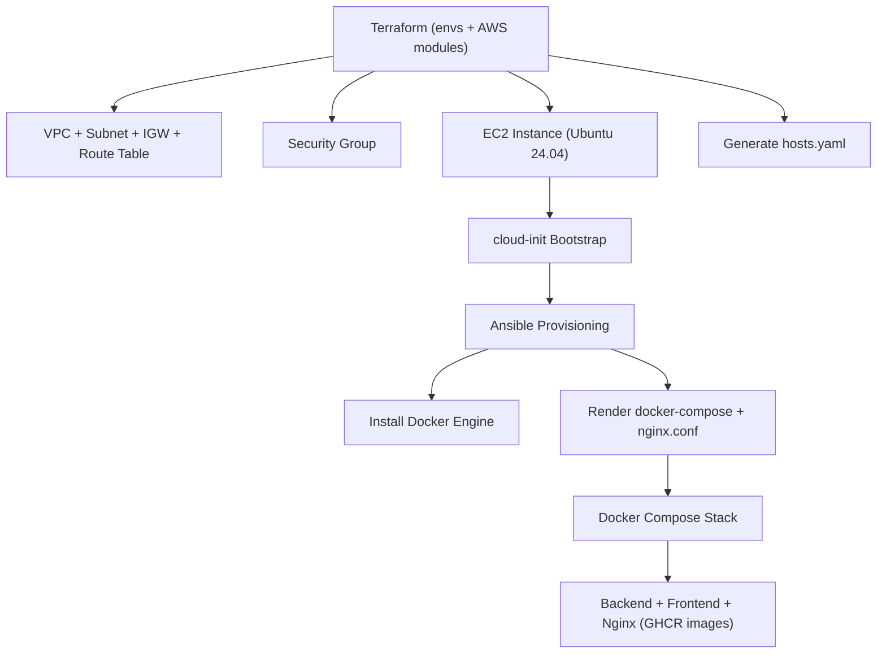

# Infrastructure Architect Demo — AWS Terraform + Ansible + Docker Stack

This repository demonstrates a **production-grade, modular Infrastructure-as-Code architecture** built with:

- **Terraform** (official terraform-aws-modules: VPC, Security Group, EC2)
- **cloud-init** (bootstrap preparation before configuration)
- **Ansible** (Docker installation & pull-based deployment)
- **Docker + GHCR** (immutable images, no builds on server)
- **GitHub Actions CI** (Terraform validation + Ansible linting)

The project mirrors real-world SRE / DevOps / Infrastructure Architect standards:
**clear separation of concerns, reproducibility, modularity, and production-style workflows.**

---

# 1. High-Level Architecture

```
Terraform → AWS (VPC, SG, EC2) → cloud-init → Ansible → Docker Compose → GHCR images
```

### Terraform (Infrastructure Layer)
- Provisions **VPC**, **public subnet**, **internet gateway**, **route table**
- Creates **Security Group** for SSH + HTTP/HTTPS
- Deploys EC2 (Ubuntu 24.04) using official AWS module
- Performs AMI lookup through **SSM Parameter Store**
- Injects **cloud-init YAML** for machine bootstrap
- Auto-generates Ansible inventory (`ansible/inventory/hosts.yaml`)

### cloud-init (Bootstrap Layer)
- Updates apt
- Installs Python3 (required by Ansible)
- Enables SSH
- Waits for full cloud-init completion
- Leaves readiness marker

### Ansible (Provisioning & Deployment Layer)
- Installs **Docker Engine** + Compose plugin
- Creates `/opt/ccore-ai`
- Renders templates:
  - `docker-compose.yml`
  - `nginx.conf`
- Pulls GHCR images (backend, frontend, nginx)
- Starts Docker Compose stack (idempotent)

### Application Layer (GHCR)
- `ghcr.io/laurisneimanis/ccore-ai-demo-backend:latest`
- `ghcr.io/laurisneimanis/ccore-ai-demo-frontend:latest`

All images are immutable and pre-built.

---

# 2. Repository Structure

```
ccore-ai-infra/
├── terraform/        # Infrastructure provisioning (AWS modules + cloud-init)
├── ansible/          # Post-provision configuration & application deployment
├── diagrams/         # Architecture diagrams (Mermaid)
├── .github/          # CI pipelines (Terraform + Ansible)
└── README.md         # Root documentation
```

---

# 3. Architecture Diagram



Full low-level version (modules + cloud-init + Ansible roles + containers):

**Full architecture diagram:** `diagrams/architecture.mmd`

---

# 4. CI Pipeline

### Terraform CI
- fmt
- init
- validate

### Ansible CI
- ansible-lint
- yamllint

---

# 5. Usage

### Provision AWS infrastructure
```
cd terraform/envs/dev
terraform init
terraform apply
```

### Provision EC2 with Ansible
```
ansible-playbook -i ansible/inventory/hosts.yaml ansible/playbook.yml
```

### Redeploy GHCR images
```
docker compose -f /opt/ccore-ai/docker-compose.yml pull
docker compose -f /opt/ccore-ai/docker-compose.yml up -d
```

---

# 6. Technologies Used

- AWS: VPC, Subnet, IGW, EC2
- Terraform: AWS modules, cloud-init, inventory generation
- Ansible: roles, templates, provisioning
- Docker + GHCR: immutable deployments
- GitHub Actions CI
- Mermaid diagrams

---

# 7. Purpose

This repository demonstrates:

- Enterprise-level IaC design
- Modern AWS Terraform module usage
- Zero-drift, pull-based server provisioning
- Clear separation of infra, config, runtime
- Production-inspired architecture
- Real DevOps & Infrastructure Architect capabilities

---

# 8. License

MIT License.
