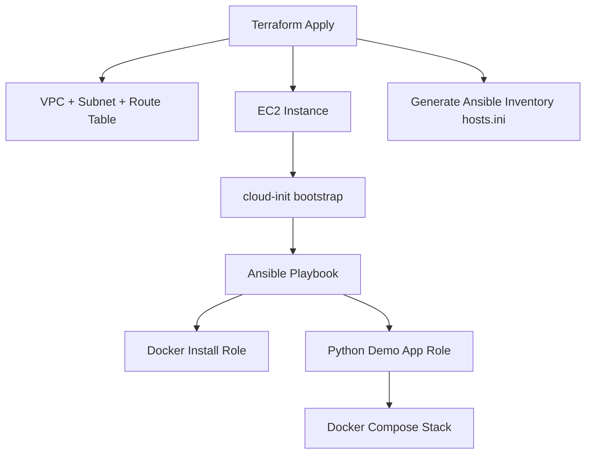
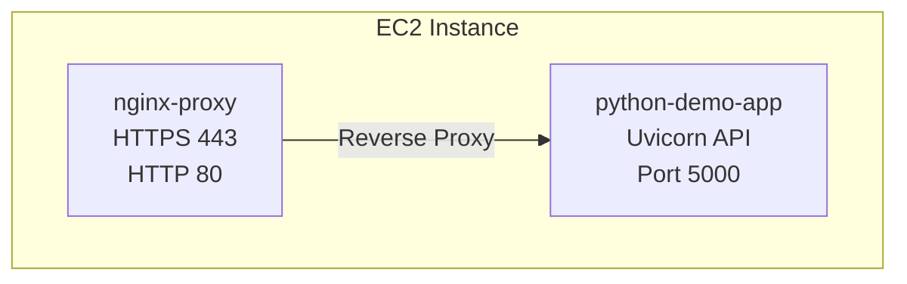

# Ansible Configuration – ccore-ai-infra

This directory contains the **post-provision configuration layer** for the AWS EC2
instance created by Terraform.  
Terraform builds the infrastructure → Ansible configures the server using Docker and Docker Compose.

This project demonstrates a clean, production‑grade DevOps workflow with a real,
fully working stack:

- Python demo application (Uvicorn)
- Nginx reverse proxy (HTTPS, self‑signed certs)
- Docker Compose orchestrating the services
- EC2 inventory **auto‑generated** by Terraform

---

## 1. Directory Structure

```
ansible/
├── inventory/
│   └── hosts.ini               # Auto-generated by Terraform
│
├── roles/
│   ├── docker-install/         # Installs Docker Engine
│   │   └── tasks/
│   │       └── main.yml
│   │
│   └── python-demo-app/        # Python app + Nginx + Docker Compose stack
│       ├── files/              # Python demo app build context
│       │   ├── .dockerignore
│       │   ├── app.py
│       │   └── requirements.txt
│       │
│       ├── tasks/
│       │   └── main.yml
│       │
│       └── templates/          # Rendered by Ansible
│           ├── Dockerfile.j2
│           ├── docker-compose.yml.j2
│           └── nginx.conf.j2
│
└── playbook.yml                # Main playbook
```

Notes:

- There is **no `group_vars/` directory** in this demo.  
  All variables are kept inside roles/templates to keep the project minimal and self‑contained.
- The Dockerfile is stored as a template: `templates/Dockerfile.j2` and rendered into `/opt/app/python-demo-app/Dockerfile` on the EC2 host.

---

## 2. Workflow Overview

### Terraform

- Creates VPC, subnet, route table
- Creates EC2 instance
- Injects bootstrap cloud‑init (Python + SSH)
- Produces inventory file:

```
ansible/inventory/hosts.ini
```

Example generated content:

```
[app]
3.67.196.100 ansible_user=ubuntu
```

### Ansible

- Installs Docker Engine
- Copies Python demo app build context
- Renders Dockerfile, nginx.conf and docker‑compose.yml from templates
- Generates Nginx SSL certs
- Starts/updates the complete stack with Docker Compose

Everything is **idempotent** — safe to run repeatedly.

---

## 3. Running Configuration

### Step 1 — Deploy AWS resources

```bash
cd terraform/envs/dev
terraform apply
```

This also generates:

```
ansible/inventory/hosts.ini
```

### Step 2 — Run Ansible provisioning

```bash
ansible-playbook -i ansible/inventory/hosts.ini ansible/playbook.yml
```

After this, the EC2 instance will run:

- Python demo API on internal port 5000
- Nginx reverse proxy on ports 80/443
- Self‑signed certificate for HTTPS
- Full Docker Compose stack managed under `/opt/app`

---

## 4. Roles

### docker-install

Installs Docker Engine using the official Docker APT repository:

- Adds Docker GPG key
- Adds Docker repository
- Installs:
  - `docker-ce`
  - `docker-ce-cli`
  - `containerd.io`
  - `docker-compose-plugin`
- Enables + starts Docker
- Adds `ubuntu` user to the `docker` group

### python-demo-app

Deploys the complete working application stack:

- Creates directory structure under `/opt/app`
- Generates self‑signed SSL certificate
- Copies Python demo app build context from `roles/python-demo-app/files/`
- Renders:
  - `/opt/app/python-demo-app/Dockerfile`
  - `/opt/app/nginx/nginx.conf`
  - `/opt/app/docker-compose.yml`
- Starts/updates the stack via:

```bash
docker compose up -d --build
```

The stack contains:

#### Python Demo App container

- Base image: `python:3.14-slim`
- Listens internally on port `5000`
- **Healthcheck is defined in the Dockerfile using Python (no curl needed):**

```dockerfile
HEALTHCHECK --interval=15s --timeout=3s --start-period=15s --retries=5   CMD python3 -c "import urllib.request; urllib.request.urlopen('http://localhost:5000/health')" || exit 1
```

This keeps the image minimal and avoids installing extra packages in slim images.

#### Nginx reverse proxy container

- Image: `nginx:1.29.3`
- Listens on `80` and `443`
- Redirects HTTP → HTTPS
- Proxies to `python-demo-app:5000` over the Compose network
- Loads SSL certs from:

```text
/opt/app/nginx/certs
```

- Includes modern security headers

---

## 5. Inventory

### Auto‑generated by Terraform

`ansible/inventory/hosts.ini` is **not stored in Git**  
because it contains ephemeral data and should always match the latest infra.

Example:

```
[app]
3.67.196.100 ansible_user=ubuntu
```

---

## 6. Architecture Diagrams

### Provisioning flow



### Application stack



---

## 7. Good Practices Applied

- No hardcoded IPs in Ansible
- Inventory created automatically by Terraform
- Single unified Docker Compose stack
- All configs templated (Dockerfile, Compose, Nginx)
- SSL cert generation automated
- Clean role separation
- No unnecessary packages in container images
- Healthchecks included
- Idempotent roles
- Standardized paths under `/opt/app`

---

## 8. Extending This Setup

Logical next steps:

- Add PostgreSQL/RDS
- Add Prometheus + Grafana
- Replace self‑signed TLS with Let’s Encrypt
- Add CI/CD via GitHub Actions
- Add staging/production envs
- Add secrets via AWS SSM Parameter Store

---

## 9. Summary

This Ansible layer delivers:

- Repeatable EC2 configuration
- Clean separation: Terraform → infra, Ansible → config
- Fully working containerized stack
- Automated TLS + reverse proxy
- Minimal but production‑style structure

Everything is production‑grade, but intentionally simple for demo purposes.
