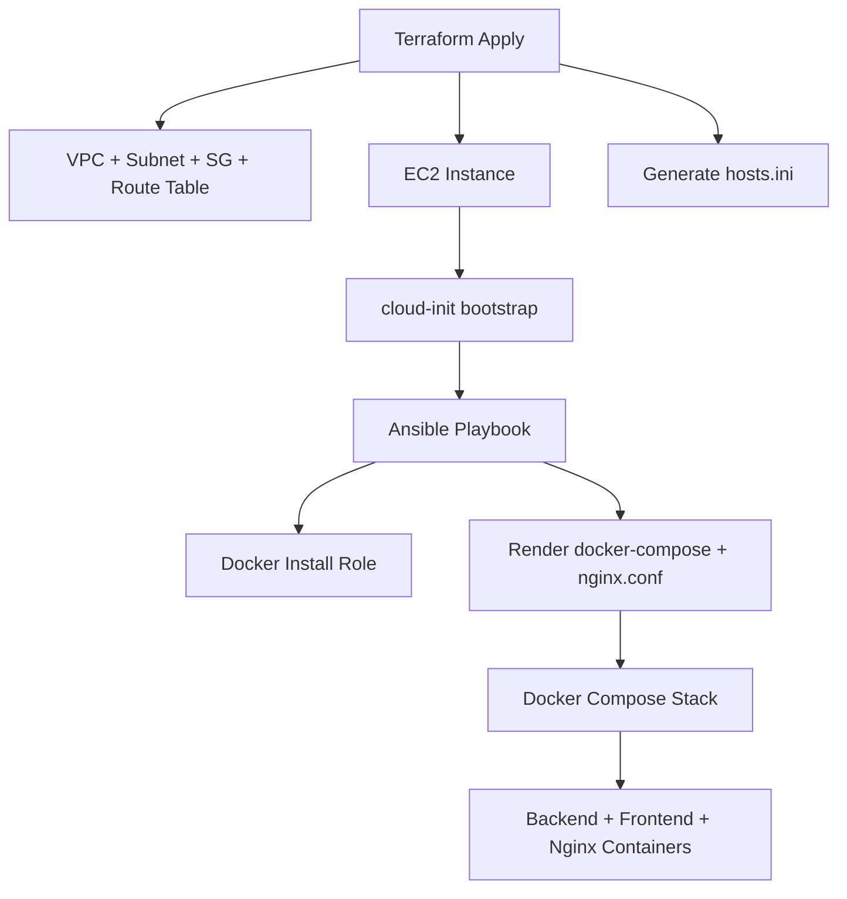

# Ansible Configuration – ccore-ai-infra

This directory contains the **post-provision configuration layer** for the EC2 instance
created by Terraform.

Terraform provisions infrastructure → cloud-init prepares the machine →
Ansible installs Docker and deploys the application stack using:

- **pre-built GHCR images**, and
- **templated configuration files** (`docker-compose.yml` and `nginx.conf`).

This ensures a clean, reproducible, pull-based deployment model on AWS EC2.

---

## 1. Directory Structure

```
ansible/
├── inventory/
│   └── hosts.ini                         # Auto-generated by Terraform
│
├── roles/
│   ├── docker-install/                   # Docker Engine installation
│   │   └── tasks/main.yml
│   │
│   └── app-deployment/                   # Application deployment (GHCR + Compose)
│       ├── tasks/main.yml
│       └── templates/
│           ├── docker-compose.yml.j2     # Defines stack (backend, frontend, nginx)
│           └── nginx.conf.j2             # Nginx reverse proxy config
│
└── playbook.yml
```

Notes:

- No Python source code is stored on the server.
- No Dockerfiles exist here — **all images come from GHCR**.
- Both `docker-compose.yml` and `nginx.conf` are rendered from templates.

---

## 2. Workflow Overview

### Terraform

- Creates AWS VPC, subnet, route table
- Deploys EC2 instance
- Injects cloud-init (installs Python3 and writes readiness marker)
- Generates inventory file:

```
ansible/inventory/hosts.ini
```

Example:

```
[app]
X.X.X.X ansible_user=ubuntu
```

### Ansible

- Installs Docker Engine and docker-compose plugin
- Creates directory `/opt/ccore-ai`
- Renders:
  - `/opt/ccore-ai/docker-compose.yml` (from `docker-compose.yml.j2`)
  - `/opt/ccore-ai/nginx/nginx.conf` (from `nginx.conf.j2`)
- Pulls GHCR container images:
  - backend: `ghcr.io/laurisneimanis/ccore-ai-demo-backend:latest`
  - frontend: `ghcr.io/laurisneimanis/ccore-ai-demo-frontend:latest`
- Starts full stack:

```bash
docker compose -f /opt/ccore-ai/docker-compose.yml up -d
```

Deployment is **idempotent** — safe to run anytime.

---

## 3. Running Provisioning

### Step 1 — Terraform deploy

```bash
cd terraform/envs/dev
terraform apply
```

### Step 2 — Ansible provisioning

```bash
ansible-playbook -i ansible/inventory/hosts.ini ansible/playbook.yml
```

Result:

- Docker installed
- docker-compose.yml + nginx.conf rendered
- GHCR images pulled
- Stack running at `/opt/ccore-ai`

---

## 4. Roles

### docker-install

Installs:

- docker-ce
- docker-ce-cli
- containerd.io
- docker-compose-plugin

Enables Docker and adds the EC2 user to the `docker` group.

### app-deployment

Responsible for all application-level configuration:

- Creates `/opt/ccore-ai`
- Renders compose + nginx templates
- Pulls container images from GHCR
- Runs:

```bash
docker compose up -d
```

No builds. No source code. Pure pull-based deployment.

---

## 5. Architecture Diagram



---

## 6. Good Practices Applied

- Pull-based server deployment (no local builds)
- Clean separation: Terraform → infra, Ansible → config, GHCR → images
- No hardcoded IPs (inventory autogenerated)
- Idempotent roles
- Clear directory structure under `/opt/ccore-ai`
- Reproducible, minimal, production-style workflow

---

## 7. Next Steps

- Add Prometheus & Grafana
- Add Let’s Encrypt automation
- Add SSM Parameter Store for secrets
- Add staging/production environments
- Trigger remote pulls automatically via CI

---

## 8. Summary

This Ansible layer provides:

- Clean post-provision EC2 configuration
- Deterministic deployment using GHCR images
- Templated configuration (compose + nginx)
- Fully working containerized stack

All of it aligned with the broader **ccore-ai** infrastructure workflow.
