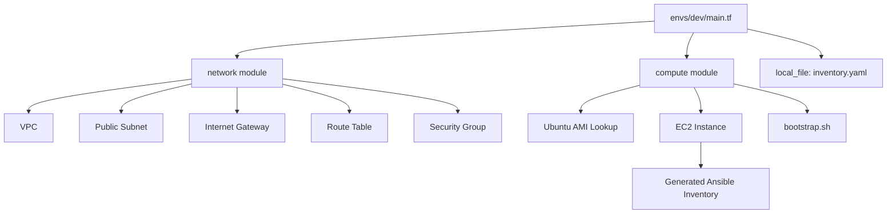

# Terraform AWS Infrastructure (Modular, Production-Grade)

This repository contains a **fully modular, production-oriented AWS Infrastructure-as-Code setup**, built using **Terraform**, following modern DevOps patterns:

- Strict separation between **modules** and **environments**
- Clean dependency flow (network → compute)
- Automated provisioning bootstrap for Ansible
- Declarative inventory generation
- Clear, reproducible, cloud-ready IaC design

This is the same architecture used across real-world DevOps, SRE, and Cloud Engineering environments.

---

# 1. Directory Structure

```
terraform/
├── envs/
│   └── dev/
│       ├── backend.tf.sample   # S3 backend template (disabled for demo)
│       ├── main.tf             # Env composition (network + compute)
│       ├── variables.tf        # Inputs
│       ├── outputs.tf          # Env-level outputs
│       ├── terraform.tfvars    # Dev bootstrap variables
│
├── modules/
│   ├── network/                # VPC, subnet, IGW, routes, SG
│   │   ├── main.tf
│   │   ├── variables.tf
│   │   └── outputs.tf
│   │
│   └── compute/                # AMI lookup, EC2 instance, KeyPair, bootstrap
│       ├── main.tf
│       ├── variables.tf
│       ├── outputs.tf
│       └── bootstrap.sh
│
├── templates/
│   └── inventory.tmpl          # Terraform → Ansible inventory generator
│
└── README.md
```

**Modules contain reusable logic.**  
**Environments contain configuration + wiring.**

---

# 2. How It Works (High-Level Architecture)

This infrastructure provisions:

### **Network Layer (modules/network)**
- VPC
- Public Subnet
- Internet Gateway
- Route Table + Association
- Security Group (22/80/443)
- Structured resource tagging

### **Compute Layer (modules/compute)**
- Latest Ubuntu 24.04 AMI (dynamic lookup)
- EC2 Instance (t3.micro by default)
- SSH KeyPair (from local public key)
- Root volume configuration
- bootstrap.sh cloud-init preparation

### **Integration Layer (envs/dev)**
- Composes network + compute modules
- Outputs public IP, VPC, subnet, SG
- Generates Ansible inventory via template

---

# 3. Auto-Generated Ansible Inventory

Terraform produces:

```
ansible/inventory/hosts.yaml
```

Example output:

```yaml
all:
  hosts:
    app:
      ansible_host: 3.120.88.15
      ansible_user: ubuntu
```

**Benefits:**
- Always up-to-date
- Zero manual edits
- Safe via .gitignore
- Enables instant provisioning

---

# 4. Bootstrap Script (Cloud-Init)

Executed automatically via EC2 user-data:

- Updates APT
- Installs Python3 for Ansible
- Ensures SSH server is running
- Writes /var/log/bootstrap_ready.log

---

# 5. Usage

### Select environment
```
cd terraform/envs/dev
```

### Initialize
```
terraform init
```

### Plan
```
terraform plan
```

### Apply
```
terraform apply
```

---

# 6. Architecture Diagram



---

# 7. CIDR & AZ Layout

```
VPC:       10.10.0.0/16
Subnet:    10.10.1.0/24
AZ:        eu-central-1a
```

---

# 8. Extensibility

Supports upgrades into:

- Multi-AZ networking
- NAT Gateways
- RDS / ElastiCache
- S3 & IAM policies
- ECS / EKS clusters
- ALB / NLB
- Terraform CI/CD
- Drift detection

---

# 9. Why This Architecture

Demonstrates:

- Senior-level IaC design
- Proper modularity
- Cloud-init integration
- Automated Ansible onboarding
- Dynamic AMI + inventory
- Clean tagging & naming
- Scalable networking
- Reproducibility

---

# 10. Summary

A clean, modern AWS IaC foundation with:

- Modular Terraform structure
- Automatic inventory generation
- Cloud-init compute provisioning
- Clear separation of concerns

Minimal. Clean. Production-ready.
