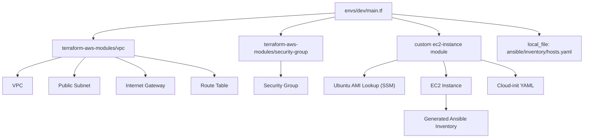

# Terraform AWS Infrastructure (Modular, Production-Grade)

This repository contains a **production-oriented AWS Infrastructure-as-Code setup**, built using **Terraform**, **official terraform-aws-modules for networking and security**, and a **small custom EC2 module**, following modern DevOps patterns:

- Clean separation between configuration (envs) and logic  
  - VPC + Security Groups → official terraform-aws-modules  
  - EC2 → lightweight custom module wrapping `aws_instance`
- Clean dependency flow (VPC → SG → EC2)
- Cloud-init–based provisioning bootstrap for Ansible
- Declarative inventory generation
- Clear, reproducible, cloud-ready IaC design

This reflects architecture used across real-world DevOps, SRE, and Cloud Engineering environments.

---

# 1. Directory Structure

```
terraform/
├── envs/
│   └── dev/
│       ├── backend.tf               # Backend configuration (local for dev)
│       ├── main.tf                  # Root env config: VPC, SG, EC2 instance
│       ├── variables.tf             # Environment-level variable definitions
│       ├── locals.tf                # Naming, tagging, reusable locals
│       ├── outputs.tf               # Outputs exposed for Ansible or CI
│       ├── data.tf                  # AMI lookups from SSM Parameter Store
│       ├── inventory.tf             # Generates dynamic Ansible inventory file
│       ├── keypair.tf               # EC2 key pair resource
│       ├── terraform.tfvars         # Actual env-specific values
│       ├── bootstrap/
│       │   └── bootstrap.yaml       # Cloud-init user_data template
│       └── templates/
│           └── inventory.tmpl       # Template used by inventory.tf to build inventory
│
├── modules/
│   └── ec2-instance/
│       ├── main.tf                  # EC2 instance resource + EBS + networking
│       ├── variables.tf             # Module input variables
│       └── outputs.tf               # Module outputs (IP, ENI, ID, DNS)
│
└── README.md                        # Full documentation: usage, structure, commands

```

> **Note**  
> `terraform.tfvars` is intentionally included for demonstration purposes to ensure full reproducibility.  
> It contains no sensitive data and is safe to store in this repository for the demo.

**Official AWS modules provide all VPC and Security Group logic.**  
**A small custom module wraps EC2 instance creation.**  
**Environments contain configuration + wiring only.**

---

# 2. How It Works (High-Level Architecture)

This infrastructure provisions:

### **Network Layer (terraform-aws-modules/vpc)**
- VPC
- Public Subnet
- Internet Gateway
- Route Table + association
- Structured resource tagging
- Optional IPv6 support

### **Security Group Layer (terraform-aws-modules/security-group)**

- SSH from restricted CIDR
- HTTP/HTTPS open
- Optional IPv6 ingress/egress

### **Compute Layer (custom ec2-instance module)**

- Latest Ubuntu 24.04 AMI from SSM Parameter Store
- EC2 instance (t3.micro by default)
- Public IPv4 + optional IPv6
- Cloud-init provisioning (user_data YAML)
- Hardened metadata (IMDSv2)
- Thin wrapper around `aws_instance` for explicit control and readability

### **Integration Layer (envs/dev)**

- Wires VPC → SG → EC2
- Generates Ansible inventory from instance IP

---

# 3. Auto-Generated Ansible Inventory

Terraform produces:

```
ansible/inventory/hosts.yaml
```

Example:

```yaml
all:
  hosts:
    app:
      ansible_host: 3.120.88.15
      ansible_user: ubuntu
```

**Benefits:**
- Always correct
- Zero manual edits
- Safe via `.gitignore`
- Enables instant provisioning

---

# 4. Cloud-Init Provisioning (bootstrap.yaml)

Executed via EC2 `user_data`:

- Updates APT
- Installs Python3 (required by Ansible)
- Ensures SSH server is installed & running
- Completes fully before Ansible via:
  ```
  cloud-init status --wait
  ```

This is **modern best practice** and completely replaces old `bootstrap.sh`.

---

# 5. Usage

### Select environment
```
cd terraform/envs/dev
```

### Initialize
```
terraform init
```

### Plan
```
terraform plan
```

### Apply
```
terraform apply
```

---

# 6. Architecture Diagram



---

# 7. CIDR & AZ Layout

```
VPC:       10.10.0.0/16
Subnet:    10.10.1.0/24
AZ:        eu-central-1a
```

---

# 8. Extensibility

Supports upgrades into:

- Multi-AZ networking
- NAT gateways
- RDS / ElastiCache
- S3 & IAM policies
- ALB / NLB
- ECS / EKS clusters
- Terraform CI/CD
- Drift detection

---

# 9. Why This Architecture

Demonstrates:

- Senior-level IaC design
- Official AWS module usage (best practice)
- Cloud-init–first provisioning
- Automated Ansible onboarding
- Dynamic AMI lookup
- Clean tagging & naming
- Scalable networking
- Reproducibility and clarity

---

# 10. Summary

A clean, modern AWS IaC foundation with:

- Official AWS modules (VPC, Security Groups)
- Custom EC2 module using `aws_instance` for full control
- Cloud-init compute provisioning
- Automatic inventory generation
- Clear separation of concerns

Minimal. Clean. Production-ready.

