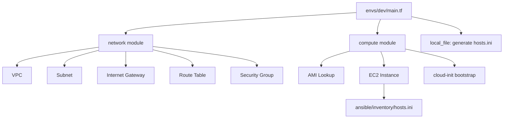

# Terraform Infrastructure

This directory contains the complete AWS Infrastructure-as-Code implementation for this project, built using **Terraform** and structured according to industry best practices.

The design follows a clean separation between reusable modules and environment-specific configuration, enabling clarity, maintainability, and production-grade workflows.

---

## 1. Directory Structure

```
terraform/
├── modules/
│   ├── network/     # VPC, subnet, IGW, route table, SG
│   └── compute/     # EC2 instance, keypair, root volume, bootstrap.sh
│
├── envs/
│   ├── dev/         # Development environment
│   │   ├── main.tf
│   │   ├── variables.tf
│   │   ├── outputs.tf
│   │   └── terraform.tfvars
│   └── prod/        # (optional) Production environment
│
└── README.md
```

Modules contain logic.  
Environments contain configuration values and tfvars.

---

## 2. Usage

### Step 1 — Select environment

```bash
cd envs/dev
```

### Step 2 — Initialize Terraform

```bash
terraform init
```

### Step 3 — Validate the plan

```bash
terraform plan
```

### Step 4 — Apply the infrastructure

```bash
terraform apply
```

Terraform provisions:

- VPC
- Public Subnet
- Internet Gateway
- Route Table
- Security Group (SSH + HTTP + HTTPS)
- EC2 instance with keypair
- Latest Ubuntu 24.04 AMI
- `bootstrap.sh` cloud-init script
- **Auto-generated Ansible inventory file**

---

## 3. Auto‑Generated Ansible Inventory

Terraform automatically creates:

```
ansible/inventory/hosts.ini
```

Example content:

```
[app]
3.67.196.100 ansible_user=ubuntu
```

This file:

- Always matches the current EC2 instance
- Is regenerated on **terraform apply**
- Is **ignored** by Git (.gitignore)

This ensures Ansible always targets the correct host with zero manual updates.

---

## 4. Bootstrap Script

Path:

```
modules/compute/bootstrap.sh
```

Executed automatically through EC2 user-data.

The script performs:

- APT cache update
- Python3 installation (for Ansible)
- SSH service validation (install if missing)
- Marker file creation: `/var/log/bootstrap_ready.log`

This ensures the instance is ready for Ansible provisioning.

---

## 5. AMI (Ubuntu 24.04 LTS)

The compute module automatically selects the newest Ubuntu **Noble 24.04** AMI.

Defined in:

```
modules/compute/data.tf
```

Filters include:

- Owner: `099720109477` (Canonical)
- Name: `ubuntu/images/hvm-ssd/ubuntu-*-amd64-server-*`
- Latest image only

---

## 6. Terraform Architecture Diagram



This diagram shows the Terraform flow from environment configuration, through modules, to inventory generation.

---

## 7. CIDR Planning

Chosen IP layout:

```
VPC:      10.10.0.0/16
Subnet:   10.10.1.0/24
AZ:       eu-central-1a
```

This avoids AWS default ranges and prevents network conflicts for VPN/peering scenarios.

---

## 8. Security

Security group created in `network` module exposes:

- SSH (22) — controlled via `allowed_ssh_cidr`
- HTTP (80)
- HTTPS (443)
- All outbound allowed

EC2 instances include structured tags:

- `Project`
- `Owner`
- `Env`
- `Role`

These tags support automation, discovery, and operational clarity.

---

## 9. Future Extensions

This Terraform model supports evolution toward:

- Multi-AZ public/private subnets
- NAT Gateways
- RDS / ElastiCache backend services
- S3 buckets / IAM resources
- ECS or EKS clusters
- GitHub Actions pipelines for Terraform
- Production-grade HA architectures

---

## 10. Summary

This Terraform structure provides:

- Clean, modern IaC architecture
- Clear separation of logic and configuration
- Senior-grade AWS/Terraform patterns
- A scalable foundation for cloud environments
- Automatic Ansible inventory generation

Minimal, clean, and production-ready.
